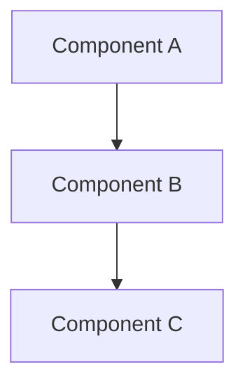

# Codegen Diagram

Generate architecture and design diagrams from source code analysis.

## When to Use
- Visualizing code architecture
- Creating class diagrams from TypeScript/Java code
- Generating sequence diagrams from API flows
- Building component relationship diagrams
- Creating ER diagrams from database schemas

## Supported Diagram Types

### Mermaid Diagrams

### Class Diagrams
- Parse TypeScript interfaces, types, and classes
- Show inheritance, composition, and dependencies
- Include method signatures and properties

### Sequence Diagrams
- Trace API call flows
- Show inter-service communication
- Document request/response patterns

### Component Diagrams
- Map module dependencies
- Show data flow between components
- Visualize architecture layers

### ER Diagrams
- Parse database schema files
- Show table relationships
- Document foreign keys and indexes

## Generation Workflow

### 1. Analyze Code
- Parse source files for structures (classes, interfaces, functions)
- Identify relationships (imports, inheritance, composition)
- Map data flow between modules

### 2. Choose Diagram Type
| Code Pattern | Recommended Diagram |
|-------------|-------------------|
| Classes/interfaces | Class diagram |
| API endpoints | Sequence diagram |
| Module structure | Component diagram |
| Database models | ER diagram |
| State management | State diagram |
| Build pipeline | Flowchart |

### 3. Generate Diagram
- Output as Mermaid markdown (preferred for inline docs)
- Or PlantUML for more complex diagrams
- Include labels and annotations

### 4. Output
Save diagrams as:
- Inline Mermaid in markdown files
- `.mmd` files for standalone diagrams
- `.svg` or `.png` for image output
